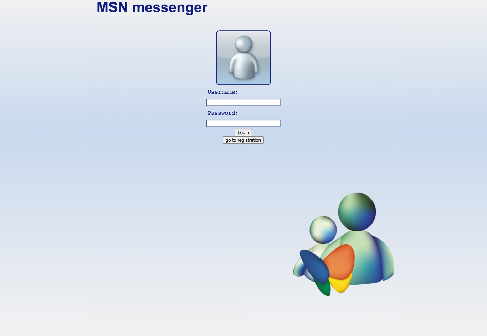
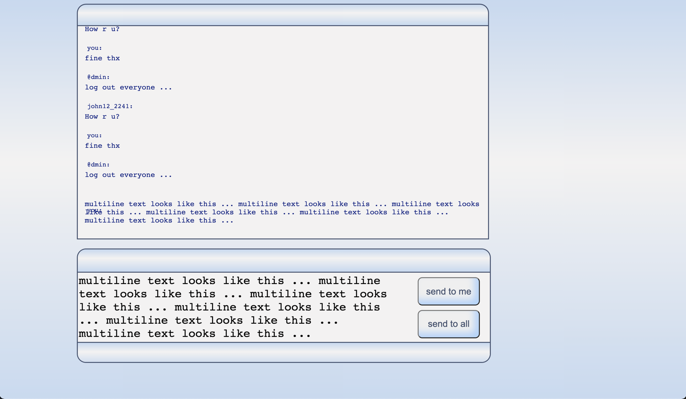
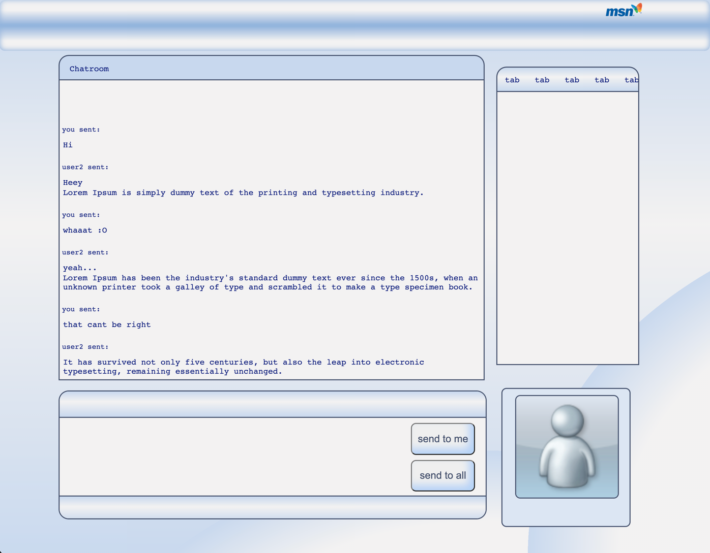

# Chatroom exercise

- Repository: `chatroom-exercise`
- Type of Challenge: `Learning`
- Duration: `2 - 4 days`
- Solo challenge

## Learning Objectives 

- Set up a node environment
- Make a connection between different clients and the servers
- Work with sockets
- Configure express and socket.io for node
- Make a basic chatroom

## The Mission
Now that you guys know how to configure a node server, let's make a chatroom to hang out with your friends and families!

### Must-have features

- [x] Make a UI that makes it easy for people to send messages in this chatroom.
- [x] It must be possible to send a message to everyone or to yourself
- [x] Make sure we can identify who sent the message through a username.
    - We could make a local variable and prompt the user to choose a username
    - We can then emit this username along with the sent message to keep track of who sent what.
- [ ] Make a list to show everyone who is connected to the chatroom
- [ ] Implement something funny! The sky is the limit! (it can be very simple if you want)
    - For example, you could make a functionality to make someone else's font size obscurely small!
    - You could implement a feature where you can speak with someone else's username
    - AND SO MUCH MORE -> BE CREATIVE
    
### Nice-to-have features

- [x] Instead of just asking for a username, we can make a user class with properties such as
    - username
    - password (if you make a login system)
    - avatar
    - font-color
    - ... whatever you want :D
    - ps: don't worry about security
- [ ] You can make different rooms to join by code
- [ ] Make it possible to send private messages to a person
- [ ] Add images, emojis, videos, gifs to your messages
- [ ] Bring back some features from MSN! (lol)
- [x] Make a login / registration (a bit more difficult)
    - again, security is not a must
  
# todo

  * list of everyone online
  * chatrooms
  * fix senders name  

### current state

login page:

messages collapse if coming from the same user

